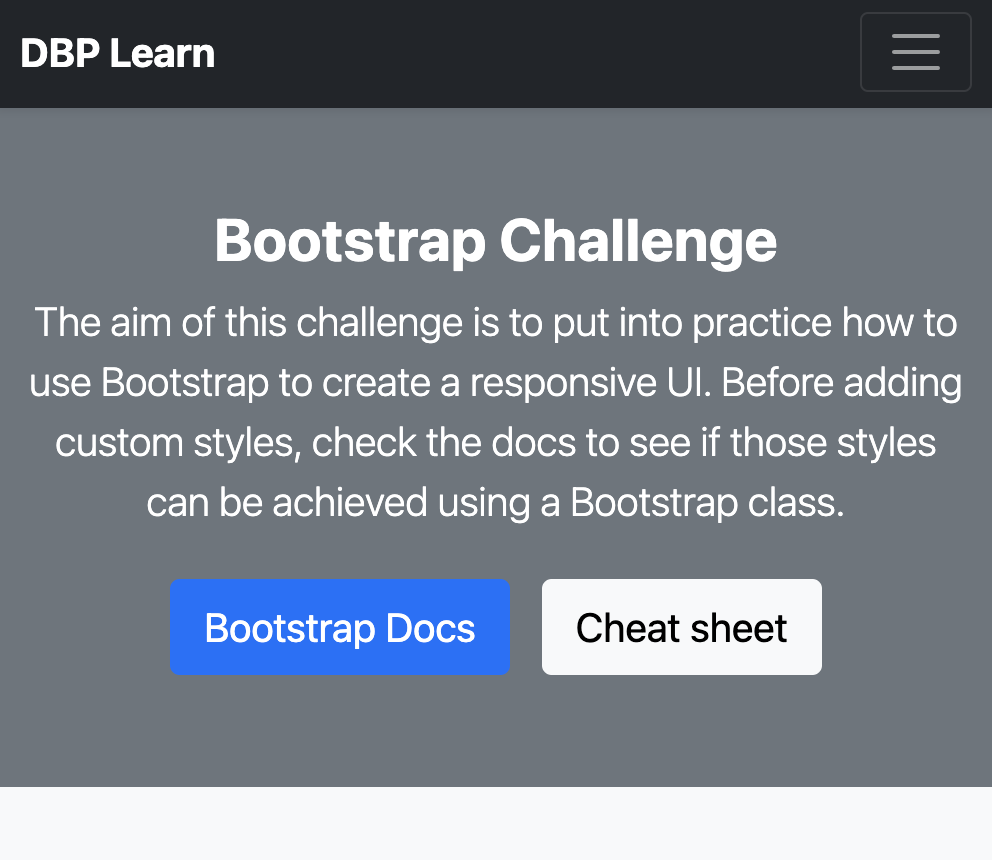
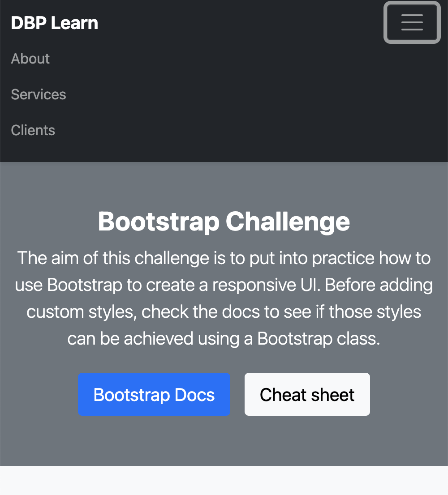

# Boostrap UI Challenge

For this challenge you will need to use [Bootstrap](https://getbootstrap.com/docs/5.1/getting-started/introduction/) classes, utilities, and components to build [this responsive layout](https://youtu.be/8zbS1px2cf8).

You can use what you have already done in the previous challenge as a starter.

**This layout contains the following sections:**

1. Heading.
2. Hero.
3. Newsletter subscription.
4. Main section with a list of 9 responsive cards.
5. Footer.

# What's expected

You should be able to build and style this UI _by just_ using Bootstrap. This means, no custom styles, no javascript. Every component should be responsive, as shown in the [demo video](https://youtu.be/8zbS1px2cf8).

1. The header should be responsive. This means that on smaller screens, the menu options should collapse. _Suggestion: You can use Bootstrap’s [Navbarv component](https://getbootstrap.com/docs/5.1/components/navbar/)._

2. Cards should arrange responsively. This means that their layout has to change according to the screen size.

   - For _xs_ there should be 1 card per row, for _sm_ 2 and for _md and bigger_ 3.

3. For the the cards, use the [Card component](https://getbootstrap.com/docs/5.1/components/card/).

   - Use the [Ratio](https://getbootstrap.com/docs/5.1/helpers/ratio/#aspect-ratios) helper on the card image to avoid the content jumping around the page when images are not loaded. In the demo we used the ratio 16x9.

4. Below the hero section, there is a newsletter section with a form. Use bootstrap classes for this form.
   - The background of this section is a gradient.

**Suggestions:**

- You can use random images from [Lorem Picsum](https://picsum.photos/) like this: https://picsum.photos/320/180?v=1, https://picsum.photos/320/180?v=2.
- You can start from our Bootstrap seed project which already has the bootstrap libraries imported.

# Objective

The purpose of this challenge is for you to practice your Bootstrap skills by creating a real UI. Please note that there is no right or wrong way to solve this. What we want to see is how you can solve this responsive layout just by using Bootstrap classes. Please try not to use any custom classes. Have fun playing with Bootstrap!
